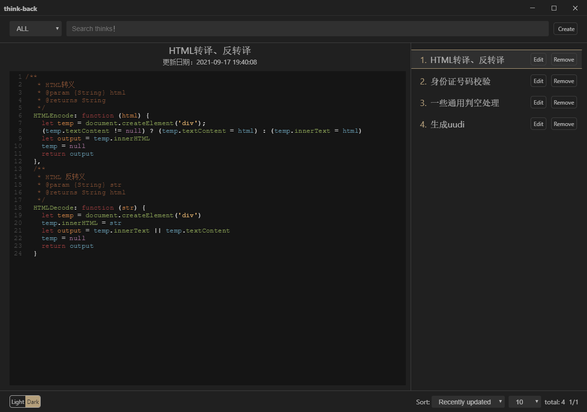
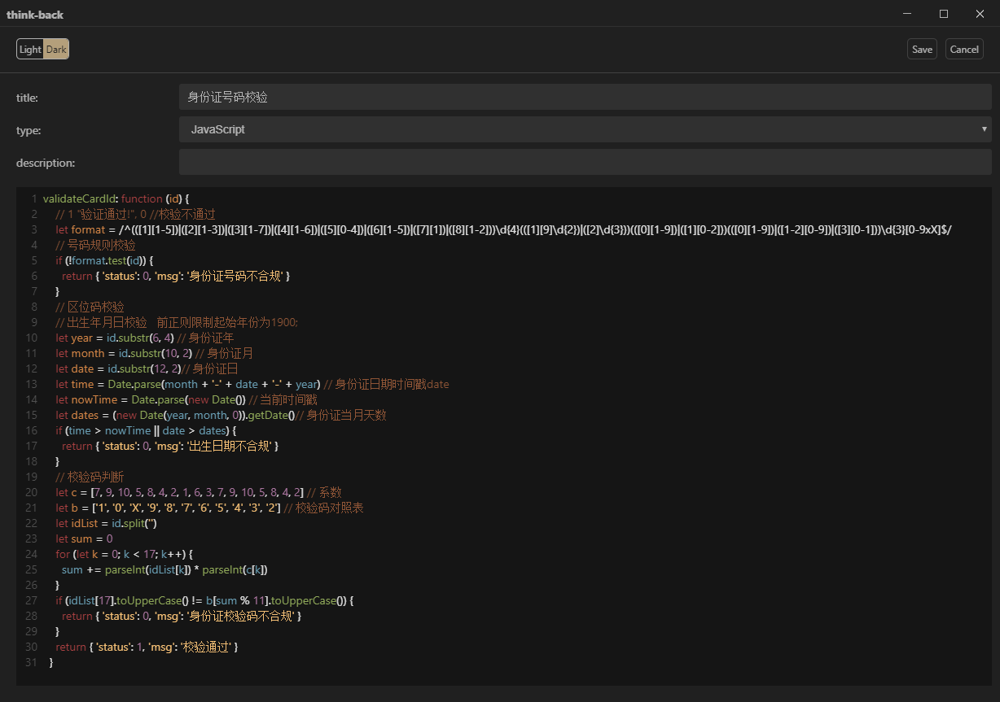

# think-back

目录

- [Think-back](#think-back)
  - [Index Page](#index-page)
  - [Edit page](#edit-page)
- [Storage](#storage)
- [Build Setup](#build-Setup)
- [Distribution issues](#distribution-issues)
- [Dependency](#dependency)

&nbsp;&nbsp;&nbsp;&nbsp;
&nbsp;&nbsp;


> 整个APP基本无图标，运行期间也不会联网发什么数据（只会在启动时借助gitee的rest API，获取下有无发行新版本。

## Think-back

- 一个桌面应用：自定义回顾一些知识，如英语单词或句子、优秀的代码、算法等，有一个统一的自我知识管理，总比建很多.txt文件、.word文件要方便。

- 支持代码高亮、一键换肤、自动跳转下一条（鼠标未在应用上时，5s切换下一条）

### Index page

- 主页面可进行知识点搜索及查看


### Edit page

- 编辑页面可进行知识点的新增与修改


## Storage

- 数据存储在内部的indexDB中。借助`Dexie.js`操作IndexDB.不考虑接入外部数据库，因为已基本满足使用。

## Build Setup

``` bash
# clone to local dir.
git clone git@gitee.com:CMRdev/think-back.git
cd think-back
# Using yarn install all dependencies.
yarn
# debug your application
npm run dev
# distribute your application
npm run buildWin

```

## Distribution issues

> 下载github上文件失败（nsis-v.xxx.7z）：

- 可手动下载完解压放到 C:\Users\Administrator\AppData\Local\electron-builder\Cache\nsis

> 当你的电脑用户名是中文【path中有中文】时：

- 打开 node_module/app-builder-lib/out/targets/nsis/NsisTarget.js文件，在 executeMakensis 方法中加入我们所需的参数：args.push("-INPUTCHARSET", "UTF8");

## Dependency

- CodeMirror(一款伟大的H5代码高亮编辑器！😄)
- Dexie.js（操作IndexDB的神器！😏）
- Electron（H5开发桌面端的神器！😁）
- Vue（不用说了吧！😁）
- vue-codemirror(神器！😁)
- vuex-electron(神器！😁)
- ... other dependencies!!
